# Linux Recycle Bin System

## Authors

Pedro Miguel Morais Gonçalves
126463
&
David Saraiva Monteiro 
125793

## Description

Este projeto teve como objetivo o desenvolvimento de um sistema de Recycle Bin para o ambiente Linux utilizando o Bash Shell Scripting. Este sistema simula essencialmente a funcionalidade Trash Can do Linux através da implementação de diversas funções modelares. Deste modo, o sistema tem a capacidade de eliminar, restaurar e listar ficheiros; gerir e armazenar metadados; registar todas as operações no log(histórico); entre outras funções adicionais. Toda a implementação foi feita em conformidade com os enunciados propostos para o Trabalho Prático 1 - Linux Recycle Bin Simulation, no âmbito da disciplina de Sistemas Operativos.

## Installation

[Atenção: Na documentação todas as referências à pasta "SO-2526-T1-P1-G05-126463-125793" aparecem como "Projeto01_SO_G05P1", uma vez que só recebemos o formato da nomenclatura da pasta no próprio dia da entrega"]

[1] - Fazer o download da pasta .zip enviada pelo elearning. Posteriormente deverá movê-la da secção "Downloads"/"Transferências" para a secção "HOME"/"Pasta Pessoal".

[2] - Extrair a pasta comprimida (Botão direito -> Extrair).

[3] - Mudar o nome da pasta para "Projeto01_SO_G05P1"

[4] - Abrir o terminal e aceder ao diretório correto (Quando o terminal é aberto já se encontra no diretório "/home/user/". Para tal deverá introduzir os seguintes comandos "cd Projeto01_SO_G05P1" e "cd G05P1_RecycleBin". Em alternativa poderá mencionar o caminho completo "cd Projeto01_SO_G05P1/G05P1_RecycleBin".

[5] - Conceder as permissões necessárias para o ficheiro principal, recorrendo ao comando: "chmod +x recycle_bin.sh"

[6] - Começar a utilizar o Recycle Bin executando os comandos pretendidos. Para obter informações acerca dos comandos, pode aceder à secção de ajuda introduzindo o seguinte comando "./recycle_bin.sh help" no terminal. Agora aparece um menu com as diversas opções disponíveis.

## Usage

- Aqui estão todas as instruções possíveis de executar com exemplos

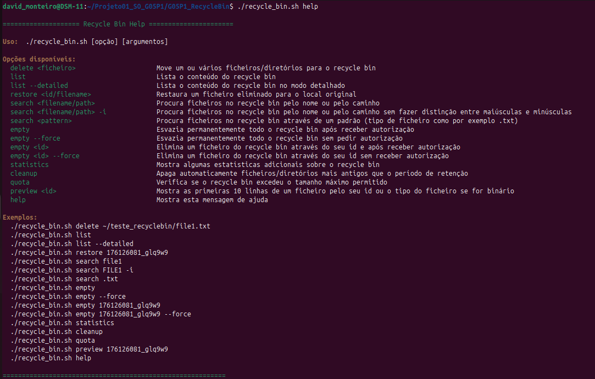

## Features
[Mandatory Features]

[1] Initialize Recycle Bin

    -Function Name: initialize_recyclebin()

[2] Delete Files/Directories

    -Function Name: delete_file()

    -Auxiliary Function Name: generate_unique_id()

[3] List Recycle Bin Contents

    -Function Name: list_recycled()

    -Function Modes: Normal Mode & Detailed Mode (using --detailed flag)

    -Auxiliary Function Name: format_size()

[4] Restore Files

    -Function Name: restore_file()

[5] Search Files

    -Function Name: search_recycled()

[6] Empty Recycle Bin

    -Function Name: empty_recyclebin()

    -Function Modes: Empty All & Empty Specific

    -Force Mode: Skip confirmation using --force flag

[7] Help System

    -Function Name: display_help()

[Optional Features]

[8] Statistics Dashboard

    -Function Name: show_statistics()

    -Auxiliary Function Name: format_size()

[9] Auto-Cleanup

    -Function Name: auto_cleanup()

[10] Quota Management

    -Function Name: check_quota()

    -Auxiliary Function Name: format_size()

[11] File Preview

    -Function Name: preview_file()

## Configuration

A configuração é feita automaticamente através da criação do ficheiro "config" sempre que o Recycle Bin é inicializado (initialize_recyclebin()) isto é, sempre que é utilizado um comando que envolva o script recycle_bin.sh. Este ficheiro contém as informações de configuração obrigatórias fornecidas relativamente ao espaço de armazenamento (MAX_SIZE_MB=1024) e ao tempo de retenção dos ficheiros (RETENTION_DAYS=30). Isto significa que segundo as configurações predefinidas, o Recycle Bin poderá guardar até 1024mb de espaço para ficheiros no prazo de 30 dias. Após esses 30 dias, a função autocleanup() trata de esvaziar completamente o Recycle Bin.

## Examples

Aqui estão os principais Test Cases com as respetivas screenshots

### Test Case 1: Initialize recycle bin structure

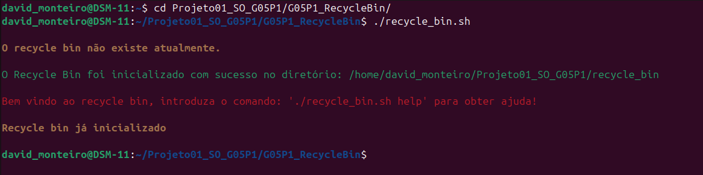 

### Test Case 2: Delete single file

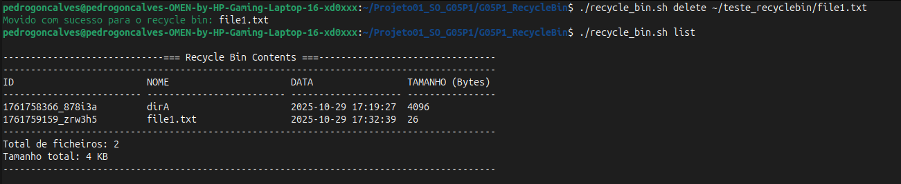

### Test Case 3: Delete multiple files in one command

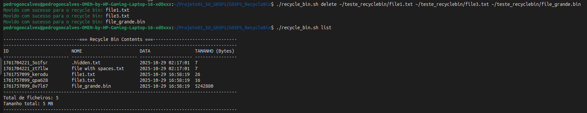 

### Test Case 4: Delete empty directory

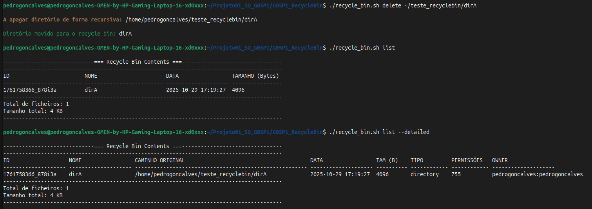

### Test Case 5: Delete directory with contents(recursive)

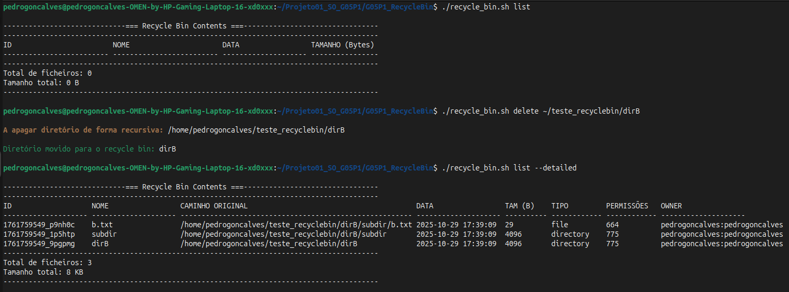

### Test Case 6: List empty recycle bin

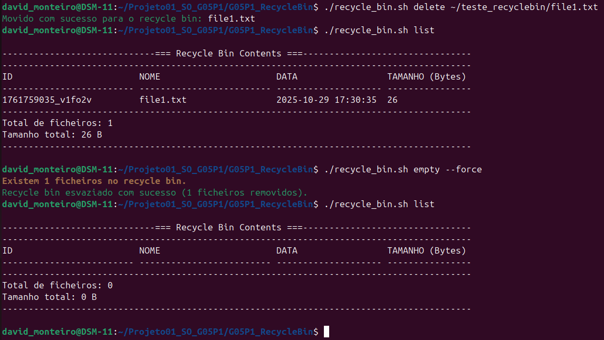

### Test Case 7: List recycle bin with items

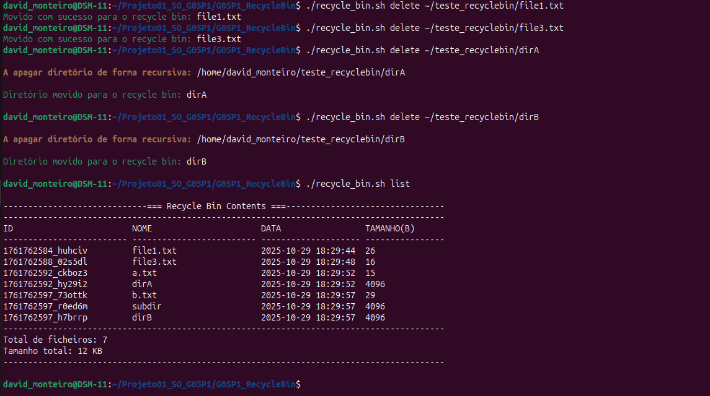

### Test Case 8: Restore single file

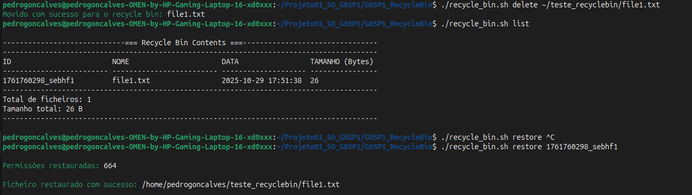

### Test Case 9: Restore to non-existent original path

### Test Case 10: Empty entire recycle bin

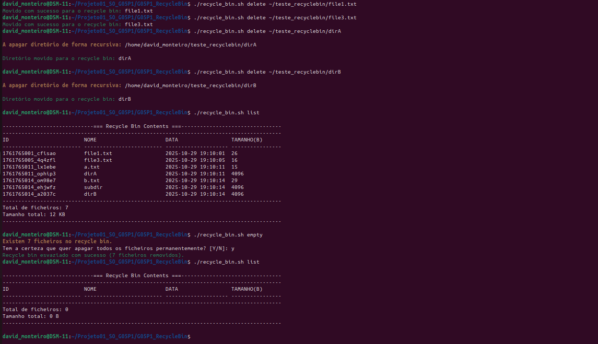 
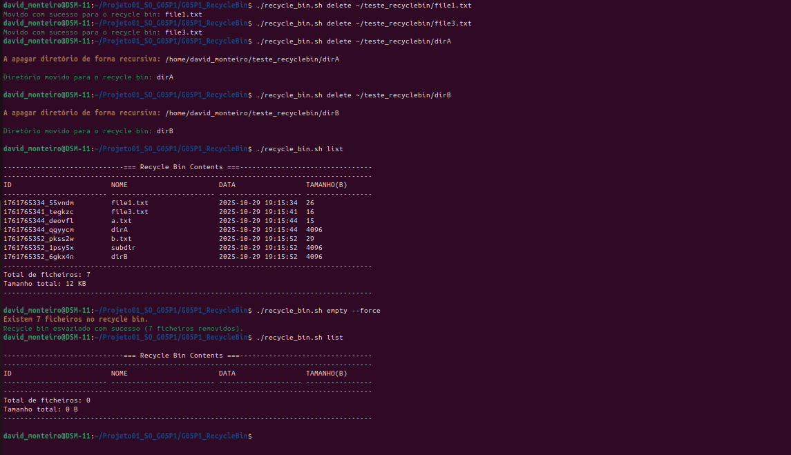

### Test Case 11: Search for existing file

### Test Case 12: Search for non-existent file

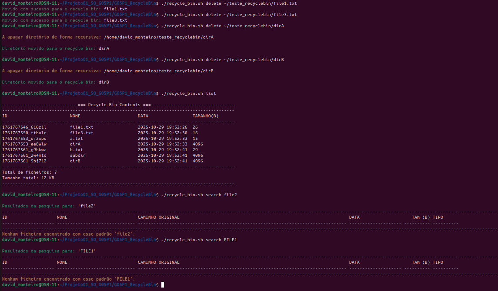

### Test Case 13: Display help information

### Test Case 14: Show Recycle Bin Statistics

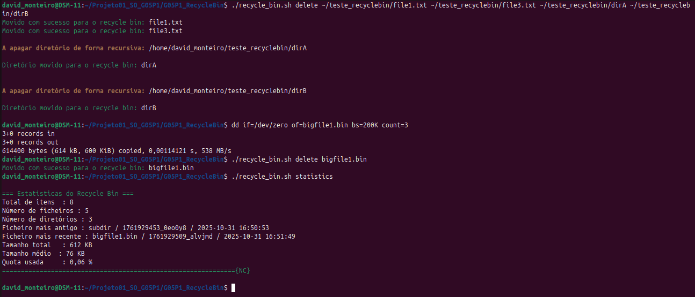

### Test Case 15: Automatic cleanup of old files

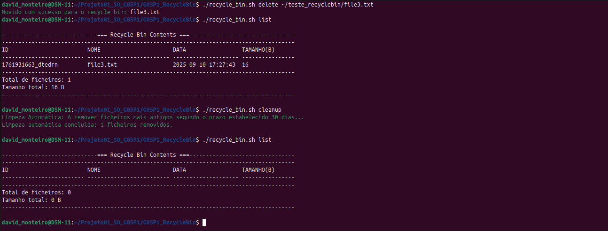

### Test Case 16: Check quota usage

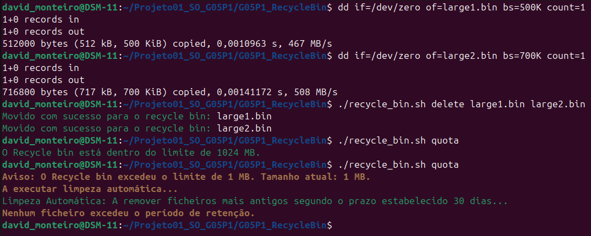

### Test Case 17: Preview File

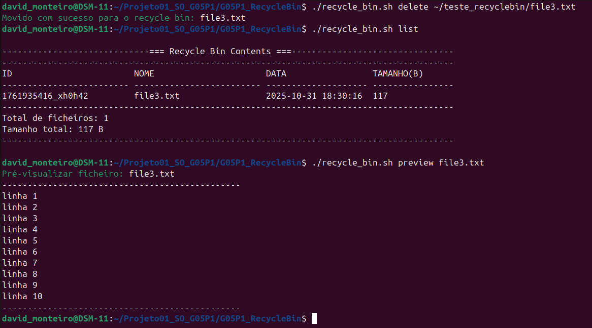

## Known Issues
[1] Problema na deteção de Ficheiros
    - Descrição do Problema: Quando um ficheiro é adicionado ao recycle_bin fora da linha de comandos, por métodos externos aos pedidos, o programa não deteta que o ficheiro se encontra dentro do recycle bin.

## References

### Fontes utilizadas

- Usamos todos os 5 documentos disponibilizados pelo professor como guia para a realização do trabalho: "Announcement of Project Proposal", "Complete Project Proposal", "Students Quick Reference Guide", "Frequently Asked Questions" e "Support Resources".

- Recorremos a estes websites para utilizar alguns comandos do bash: "https://www.hostinger.com/tutorials/awk-command" & "https://www.w3schools.com/bash/bash_echo.php"

- Recorremos à utilização de ferramentes de AI (ChatGPT) para fazer o debbuging de algumas funções como o search_recycled() e para explicar o conceito do erro cometido numa primeira abordagem tal como é permitido. Também utilizamos para nos assistir nos testes do ficheiro test_suite.sh inclusivé em erros de sintaxe em bash.

- Recorremos ao website Plant UML para realizar os diagramas apresentados "https://plantuml.com"
