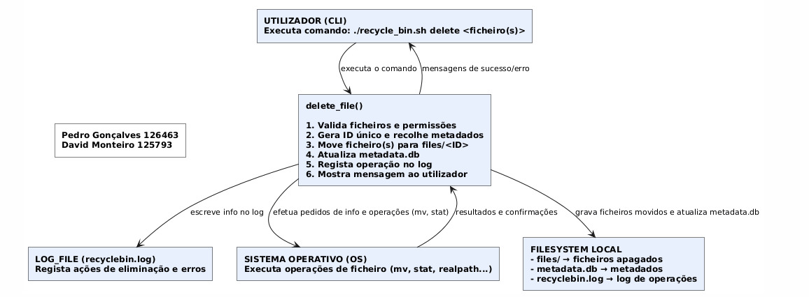

# Linux Recycle Bin System

## Authors

Pedro Miguel Morais Gonçalves
126463
&
David Saraiva Monteiro 
125793

## System architecture diagram

## Data flow diagrams

***Initialize Recycle Bin Function***
 

***Delete File Function***

***List Recycled Function***

***Restore File Function***

***Empty Recycle Bin Function***

***Search Recycled Function***

O seguinte diagrama não contém pequenas alterações que foram feitas à função (ex: não foi utilizado o comando "sed")

***Display Help Function***

## Metadata schema explanation

**Explicação Geral**
- O ficheiro metadata.db é um ficheiro do tipo CSV que guarda a informação essencial de todos os ficheiros e diretórios contidos no Recycle Bin. A primeira linha contém o cabeçalho que apresenta a seguinte estrutura.
 "ID,ORIGINAL_NAME,ORIGINAL_PATH,DELETION_DATE,FILE_SIZE,FILE_TYPE,PERMISSIONS,OWNER"

As linhas seguintes apresentam os metadados de cada ficheiro contido no Recycle Bin

**Estrutura Detalhada**
- ID : Identificador único do ficheiro criado pela função "generate_unique_id" (Explicação de como é criado o ID na descrição da função abaixo). É usado como nome dentro da pasta "files".
- ORIGINAL_NAME : Nome original do ficheiro/diretório antes da sua eliminação.
- ORIGINAL_PATH : Caminho completo do ficheiro no sistema antes de ser movido para o Recycle Bin.
- DELETION_DATE : Data e hora exatas em que o ficheiro foi eliminado.
- FILE_SIZE : Tamanho original do ficheiro em bytes.
- FILE_TYPE : Tipo do item ("file" para ficheiro normal / "directory" para diretório).
- PERMISSIONS : Permissões originais do ficheiro usadas na restauração.
- OWNER : Proprietário e grupo original do ficheiro.

**Utilização Prática**
- delete_file() - Nesta função é adicionada uma nova linha com as informações do ficheiro apagado.
- restore_file() - Nesta função é removida a linha correspondente ao ficheiro restaurado
- empty_recyclebin() e auto_cleanup() - Estas funções apagam linhas dos ficheiros removidos permanentemente
- list_recycled(), search_recycled(), show_statistics() - Estas funções leem o ficheiros para gerar tabelas ou estatísticas relativas às informações dos ficheiros

**Exemplo de uma linha com metadados** 
1761833501_2rr6z1,file1.txt,/home/david_monteiro/teste_recyclebin/file1.txt,2025-10-30 14:11:41,26,file,664,david_monteiro:david_monteiro

## Function descriptions & Algorithm Explanations

***Initialize Recycle Bin Function***
- Inicializa a estrutura principal do Recycle Bin. No caso do diretório base não existir, cria toda essa estrutura necessária (pasta files, ficheiro metadata.db, ficheiro config, ficheiro recyclebin.log). Também são definidos seus os parâmetros como o tamanho máximo permitido e o tempo de retenção. Garante que os ficheiros essenciais estão presentes e regista a operação no log.

***Generate Unique Id Function***
- Gera um identificador único para cada ficheiro ou diretório movido para o Recycle Bin. Esse ID é composto por um timestamp e uma string de 6 caracteres alfanuméricos.

***Delete File Function***
- Move ficheiros ou diretórios para o Recycle Bin e preserva os seus metadados. Verifica permissões e espaço livre antes de executar a remoção. Se o alvo for um diretório, elimina-o de forma recursiva e regista individualmente cada item contido nesse diretório. É criada uma entrada com os seus metadados e adicionado um registo ao log.

***Format Size Function***
- Converte um valor em bytes para um formato que seja compreensível para as pessoas em geral ajustando automaticamente a unidade conforme o tamanho (KB, MB, GB).

***List Recycled Function***
- Apresenta em formato de lista todos os ficheiros armazenados no Recycle Bin. O utilizador pode escolher ver uma versão mais simples ou mais detalhada dos metadados de cada ficheiro/diretório. Também é calculado o número total de ficheiros e o tamanho total ocupado.

***Restore File Function***
- Restaura um ficheiro ou diretório do Recycle Bin para a sua localização/diretório original. Se o caminho já existir, é possível escolher entre substituir, renomear ou cancelar a operação. Restaura as permissões originais e remove a entrada do ficheiro do ficheiro com os metadados.

***Empty Recycle Bin Function***
- Esvazia o Recycle Bin, apagando permanentemente todos os ficheiros ou apenas um ficheiro específico identificado pelo seu ID. Apresenta a flag "--force" para saltar a confirmação. O ficheiro metadata.db é atualizado e as operações são registadas no log.

***Search Recycled Function***
- Procura ficheiros contidos no Recycle Bin através de padrões, nomes, caminhos ou extensões. Suporta a pesquisa sensível ou insensível a maiúsculas/minúsculas com a flag "-i". Os resultados são apresentados numa tabela formatada e a pesquisa quer seja bem sucedida ou não é registada no log.

***Show Statistics Function***
- Calcula e apresenta estatísticas globais do Recycle Bin, como o número total de ficheiros e diretórios, o tamanho médio, o ficheiro mais antigo e mais recente e a percentagem de quota utilizada.

***Auto Cleanup Function***
- Elimina automaticamente ficheiros que excedam o período de retenção estabelecido (RETENTION_DAYS). Calcula a data limite, identifica ficheiros mais antigos e remove-os. O ficheiro metadata.db é atualizado e a operação é registada no log.

***Check Quota Function***
- Verifica se o espaço total ocupado pelos ficheiros do Recycle Bin ultrapassa o limite máximo estabelecido (MAX_SIZE_MB). Se o limite for excedido, a função apaga todos esses ficheiros mais antigos. Cada linha do ficheiro metadata.db que corresponde a esses ficheiros é removida e a operação em si é registada no log.

***Preview File Function***
- Mostra as primeiras 10 linhas de um ficheiro que existe dentro do Recycle Bin no caso de este se tratar de um ficheiro de texto. No caso de ser binário, apresenta apenas o tipo de ficheiro. A ação de pré-visualizar o ficheiro é registada no log.

***Display Help Function***
- Apresenta uma mensagem de ajuda com a descrição de todos os comandos disponíveis, como utilizar cada comando e exemplos práticos como referência para o utilizador.

***Main Function***
- Função principal que serve como ponto de partida deste script. Inicializa o Recycle Bin, interpreta os argumentos introduzidos pelo utilizador e direciona a execução para a função corresponde (entre aquelas disponíveis para utilizar através de comandos, não auxiliares)

