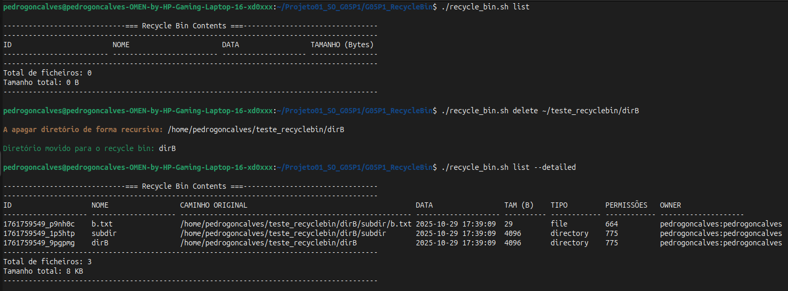
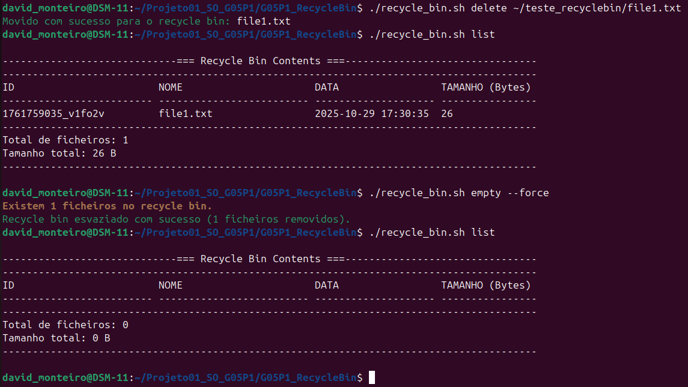
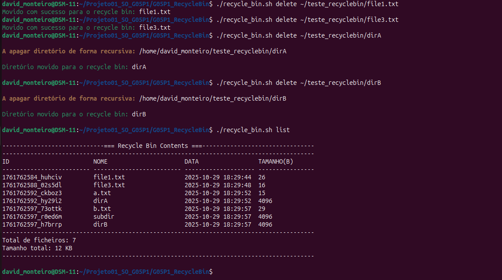
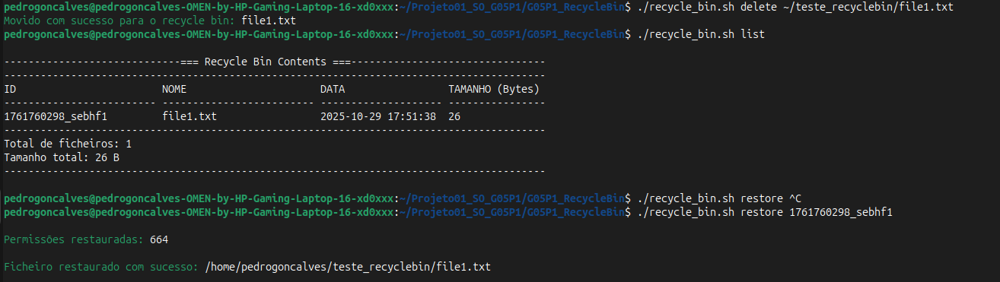
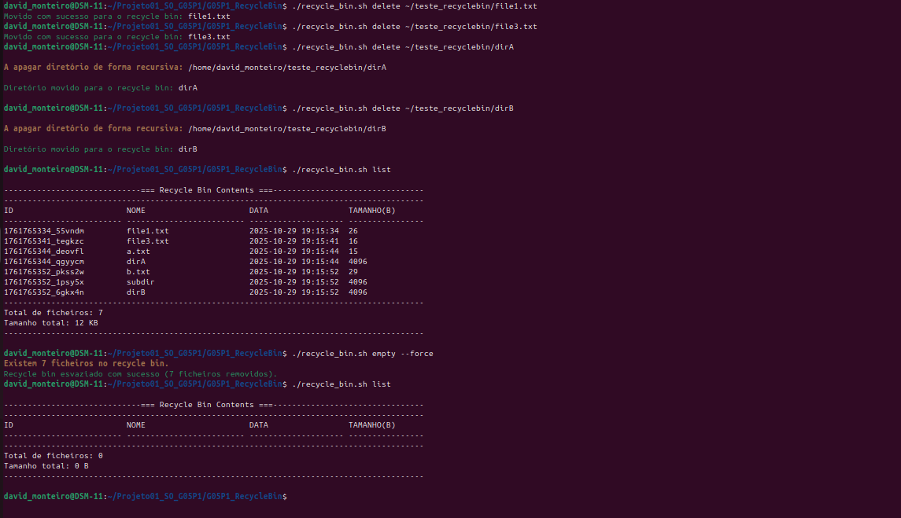
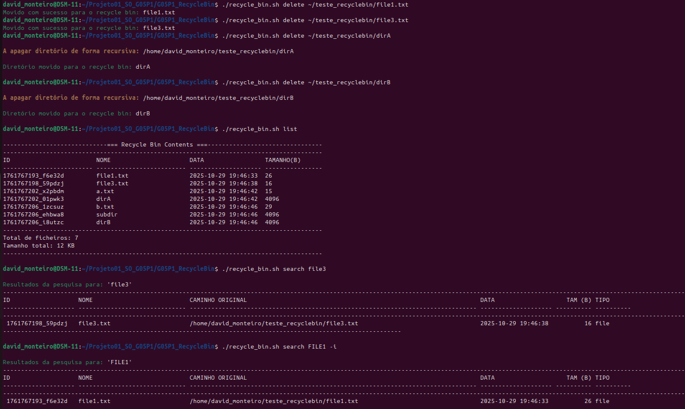
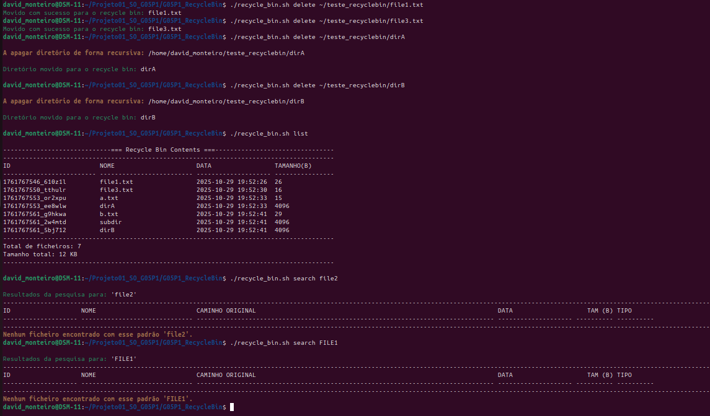

# Linux Recycle Bin System

## Authors

Pedro Miguel Morais Gonçalves
126463
&
David Saraiva Monteiro 
125793

## Test Plan overview

O nosso plano de testes consiste em testar as funções principais e obrigatórias primeiro e só depois testar as funções opcionais. As funções serão testadas pela ordem estabelecida nos requisitos (Secção Features no documento README.md) para evitar possíveis erros derivados de dependências entre funções. Em primeiro lugar, decorrerão os testes das "Funcionalidades Básicas"/"Basic Functionalities" tanto das funções principais como das funções opcionais. Em segundo lugar, vamos testar os "Casos Extremos"/"Edge Cases" associados às diferentes funções. Em terceiro lugar, será feito o "Tratamento de Erros"/"Error Handling" para verificar se as mensagens de erro foram bem implementadas. Por último, terão lugar os "Testes de Performance"/"Performance Tests" para verificar o modo como o sistema lida com ficheiros maiores e operações mais complexas. É preciso mencionar que ada função terá um ou vários cenários de teste para cobrir todas as possibilidades de chamar as funções com diferentes argumentos e flags predefinidas. O script deve ser sempre testado no seguinte diretório "/home/user/Projeto01_SO/G05P1_RecycleBin" (ver regras de instalação no documento README.md).

## Test cases with results

### Test Case 1: Initialize recycle bin structure
**Objetivo:** Verificar se é criada a pasta recycle_bin com todos os ficheiros necessários (diretório "Files", ficheiro "config", ficheiro "log.txt", ficheiro metadata.bd). Isto é, verificar se tem a estrutura correta para que o resto das funções funcionem.

**Passos:**
1. Run: `./recycle_bin.sh`
2. Verificar a emissão da mensagem "O recycle bin não existe atualmente."
3. Verificar a emissão da mensagem "A recycle bin foi inicializada com sucesso no diretório: /home/user/Projeto01_SO/recycle_bin"
4. Averiguar a criação da pasta recycle_bin
5. Averiguar o conteúdo da pasta recycle_bin

**Resultado Esperado:**
- A pasta recycle_bin foi criada no diretório "/home/user/Projeto01_SO/recycle_bin"
- O diretório "Files" foi criado dentro da pasta recycle_bin
- O ficheiro "config" foi criado dentro da pasta recycle_bin com as informações MAX_SIZE_MB=1024 e RETENTION_DAYS=30
- O ficheiro "log.txt" foi criado dentro da pasta recycle_bin com a data da inicialização do recycle bin
- O ficheiro "metadata.bd" foi criado dentro da pasta recycle_bin com as seguintes informações ID,ORIGINAL_NAME,ORIGINAL_PATH,DELETION_DATE,FILE_SIZE,FILE_TYPE,PERMISSIONS,OWNER

**Resultado Atual:** 
- A pasta recycle_bin foi criada no diretório "~/Projeto01_SO/recycle_bin"
- O diretório "Files" foi criado dentro da pasta recycle_bin
- O ficheiro "config" foi criado dentro da pasta recycle_bin com as informações MAX_SIZE_MB=1024 e RETENTION_DAYS=30
- O ficheiro "log.txt" foi criado dentro da pasta recycle_bin com a data da inicialização do recycle bin
- O ficheiro "metadata.bd" foi criado dentro da pasta recycle_bin com as seguintes informações ID,ORIGINAL_NAME,ORIGINAL_PATH,DELETION_DATE,FILE_SIZE,FILE_TYPE,PERMISSIONS,OWNER

**Estado do Teste:** Pass 

**Screenshots:** [Ver pasta]

### Test Case 2: Delete single file
**Objetivo:** Verificar se o sistema apaga corretamente um único ficheiro, ou seja, se o move de forma correta para o recycle bin.

**Passos:**
1. Criar um ficheiro de teste: `echo "test" > test.txt`
2. Executar o comando: `./recycle_bin.sh delete test.txt`
3. Verificar que o ficheiro foi movido para o diretório atual
4. Executar: `./recycle_bin.sh list`
5. Confirmar que o ficheiro está listado no recycle bin.

**Resultado Esperado:**
- O ficheiro é movido para  ~/Projeto01_SO_G05P1/recycle_bin/files/(id_do_ficheiro)
- As informações são adicionadas ao metadata.db
- Uma mensagem de sucesso é apresentada no terminal
- O ficheiro aparece no recycle bin.

**Resultado Atual:**
- O ficheiro é movido para  ~/Projeto01_SO_G05P1/recycle_bin/files/(id_do_ficheiro)
- As informações são adicionadas ao metadata.db
- Uma mensagem de sucesso é apresentada no terminal
- O ficheiro aparece no recycle bin.

**Estado do Teste:** Pass 

**Screenshots:**
 

### Test Case 3: Delete multiple files in one command
**Objetivo:** Verificar se o sistema apaga corretamente vários ficheiros de uma só vez.

**Passos:**
1. Criar ficheiros de teste: " echo "1" > a.txt  echo "2" > b.txt  echo "3" > c.txt " (executar cada um numa linha do terminal) ou utilizar ficheiros criados para a finalidade de teste.
2. Executar: `./recycle_bin.sh delete a.txt b.txt c.txt` ou o comando de delete com o nome de outros ficheiros de teste.
3. Confirmar que os ficheiros foram removidos do diretório atual.
4. Executar: `./recycle_bin.sh list`
5. Verificar que os ficheiros apagados aparecem listados. 

**Resultado Esperado:**
- Todos os ficheiros são movidos para /home/user/Projeto01_SO_G05P1/recycle_bin/files/
- Cada ficheiro tem uma entrada no ficheiro metadata.db
- O log recyclebin.log contém um registo para cada operação
- Mensagens de sucesso apresentadas para cada ficheiro

**Resultado Atual:** 
- Todos os ficheiros são movidos para /home/user/Projeto01_SO_G05P1/recycle_bin/files/
- Cada ficheiro tem uma entrada no ficheiro metadata.db
- O log recyclebin.log contém um registo para cada operação
- Mensagens de sucesso apresentadas para cada ficheiro

**Estado do Teste:** Pass 

**Screenshots:**
 

### Test Case 4: Delete empty directory
**Objetivo:** Verificar se o sistema apaga corretamente um diretório vazio.

**Passos:**
1. Criar o diretório: mkdir emptydir ou utilizar ficheiros criados para a finalidade de teste.
2. Executar: `./recycle_bin.sh delete emptydir` ou substiruir "emptydir" pelo nome de outro diretório vazio
3. Verificar a mensagem de sucesso a informar que o diretório foi removido
4. Executar: `./recycle_bin.sh list` ou `./recycle_bin.sh list --detailed` 

**Resultado Esperado:**
- O diretório é movido para o recycle bin
- É registado no metadata.db como tipo “directory”
- Registo de operação adicionado ao recyclebin.log
- Mensagem de sucesso apresentada

**Resultado Atual:** 
- O diretório é movido para o recycle bin
- É registado no metadata.db como tipo “directory”
- Registo de operação adicionado ao recyclebin.log
- Mensagem de sucesso apresentada

**Estado do Teste:** Pass 

**Screenshots:** 
 

### Test Case 5: Delete directory with contents(recursive)
**Objetivo:** Verificar se o sistema apaga corretamente um diretório com ficheiros e subdiretórios.

**Passos:**
1. Criar estrutura de diretórios: `mkdir -p folder/sub  echo "a" > folder/a.txt  echo "b" > folder/sub/b.txt ` (executar cada um numa linha do terminal) ou utilizar ficheiros criados para a finalidade de teste.
2. Executar: `./recycle_bin.sh delete folder` ou trocar "folder" pelo nome/path do diretório com subdiretórios de teste.
3. Verificar mensagem "A apagar diretório de forma recursiva..."
3. Executar: `./recycle_bin.sh list`

**Resultado Esperado:**
-    Todos os ficheiros e subdiretórios são movidos para o recycle bin
- Cada item tem uma linha no metadata.db
- O diretório original é removido
- É apresentada mensagem “A apagar diretório de forma recursiva”

**Resultado Atual:**
- Todos os ficheiros e subdiretórios são movidos para o recycle bin
- Cada item tem uma linha no metadata.db
- O diretório original é removido
- É apresentada mensagem “A apagar diretório de forma recursiva”

**Estado do Teste:** Pass

**Screenshots:**
 

### Test Case 6: List empty recycle bin
**Objetivo:** Verificar se o comando `./recycle_bin.sh list` apresenta corretamente o recycle bin em formato de tabela, incluindo todos os detalhes - ID, NOME, DATA, TAMANHO quando este se encontra vazio.

**Passos:**
1. Criar um ficheiro de teste: `echo "file1" > file1.txt`. Ou em alternativa, utilizar uma pasta com ficheiros e diretórios lá dentro para testar (neste caso em específico foram utilizados ficheiros e diretórios da pasta teste_recyclebin disponibilizada na entrega)
2. Run: `./recycle_bin.sh delete file1.txt`
3. Confirmar que o ficheiro file1.txt foi removido do diretório original
4. Run: `./recycle_bin.sh list`
5. Verificar que o ficheiro "file1.txt" se encontra listado no recycle bin
6. Run: `./recycle_bin.sh empty --force`
7. Run: `./recycle_bin.sh list`
8. Verificar que o recycle bin se encontra vazio e que a metadata foi limpa

**Resultado Esperado:**
- O ficheiro file1.txt é movido para ~/Projeto01_SO_G05P1/recycle_bin/files/
- O ficheiro aparece listado no recycle bin com as informações ID, NOME, DATA E TAMANHO
- O ficheiro é removido permanentemente após esvaziar o recycle bin
- Aparece uma listagem do recycle bin sem um único ficheiro e mostra que o número total de itens e o tamanho total são nulos
- Metadata foi limpa e todas as operações foram registadas no log file

**Resultado Atual:** 
- O ficheiro file1.txt é movido para ~/Projeto01_SO_G05P1/recycle_bin/files/.
- O ficheiro aparece listado no recycle bin com as informações ID, NOME, DATA E TAMANHO
- O ficheiro é removido permanentemente após esvaziar o recycle bin
- Aparece uma listagem do recycle bin sem um único ficheiro e mostra que o número total de itens e o tamanho total são nulos.
- Metadata foi limpa e todas as operações foram registadas no log file.

**Estado do Teste:** Pass

**Screenshots:** 
 

### Test Case 7: List recycle bin with items
**Objetivo:** Verificar se o comando `./recycle_bin.sh list` apresenta corretamente os ficheiros presentes no recycle bin em formato de tabela, incluindo todos os detalhes - ID, NOME, DATA, TAMANHO.

**Passos:**
1. Criar vários ficheiros de teste: `echo "file1" > file1.txt` `echo "file2" > file2.txt` `echo "file3" > file3.txt`. Ou em alternativa, utilizar uma pasta com ficheiros e diretórios lá dentro para testar (neste caso em específico foram utilizados ficheiros e diretórios da pasta teste_recyclebin disponibilizada na entrega)
2. Run: `./recycle_bin.sh delete file1.txt file3.txt dirA dirB`
3. Confirmar que os ficheiros e diretórios foram removidos do diretório original
4. Run: `./recycle_bin.sh list`
5. Verificar que os ficheiros e diretórios aparecem com a formatação da tabela

**Resultado Esperado:**
- O ficheiros e diretórios são movidos para ~/Projeto01_SO_G05P1/recycle_bin/files/ cada um com o seu ID específico
- Foram criadas as entradas correspondentes aos ficheiros e diretórios no metadata.db
- O ficheiros e diretórios aparecem listados em formato de tabela no recycle bin com as informações ID, NOME, DATA E TAMANHO
- Todas as operações foram registadas no log file

**Resultado Atual:** 
- O ficheiros e diretórios são movidos para ~/Projeto01_SO_G05P1/recycle_bin/files/ cada um com o seu ID específico
- Foram criadas as entradas correspondentes aos ficheiros e diretórios no metadata.db
- O ficheiros e diretórios aparecem listados em formato de tabela no recycle bin com as informações ID, NOME, DATA E TAMANHO
- Todas as operações foram registadas no log file

**Estado do Teste:** Pass

**Screenshots:**  

### Test Case 8: Restore single file
**Objetivo:** Verificar se um ficheiro apagado é restaurado corretamente para o seu diretório original.

**Passos:**
1. Criar ficheiro:`echo "restaurar" > restore.txt`
2. Executar: `.recycle_bin.sh delete restore.txt`
3. Executar:`./recycle_bin.sh restore restore.txt`
4. Confirmar que o ficheiro reaparece no diretório original

**Resultado Esperado:**
- Ficheiro restaurado com o mesmo nome e conteúdo
- Entrada removida do metadata.db
- Mensagem “Ficheiro restaurado com sucesso” exibida
- Registo adicionado ao ficheiro recyclebin.log

**Resultado Atual:** 
- Ficheiro restaurado com o mesmo nome e conteúdo
- Entrada removida do metadata.db
- Mensagem “Ficheiro restaurado com sucesso” exibida
- Registo adicionado ao ficheiro recyclebin.log

**Estado do Teste:** Pass

**Screenshots:** 
 

### Test Case 9: Restore to non-existent original path
**Objetivo:** Verificar se o sistema recria o diretório original quando este foi apagado.

**Passos:**
1. Criar pasta e ficheiro: `mkdir olddir  echo "dados" > olddir/x.txt  ./recycle_bin.sh delete olddir/x.txt  rm -r olddir` (executar cada um numa linha do terminal) ou utilizar ficheiros criados para a finalidade de teste.
2. Executar: `./recycle_bin.sh restore x.txt` ou substituir "test.txt" pelo nome de outro ficheiro que se deseja apagar.
3. Verificar se o diretório é recriado e o ficheiro é restaurado.

**Resultado Esperado:**
- É apresentada a mensagem “O diretório original não existe. A criar...”
- O diretório é recriado automaticamente
- O ficheiro é restaurado com sucesso e com as permissões originais
- Entrada removida de metadata.db

**Resultado Atual:**
- É apresentada a mensagem “O diretório original não existe. A criar...”
- O diretório é recriado automaticamente
- O ficheiro é restaurado com sucesso e com as permissões originais
- Entrada removida de metadata.db

**Estado do Teste:** Pass 

**Screenshots:** 
 

### Test Case 10: Empty entire recycle bin
**Objetivo:** Verificar se os comandos `./recycle_bin.sh empty`e `./recycle_bin.sh empty --force` removem corretamente todos os ficheiros presentes no recycle bin. No primeiro caso a pedir permissão e no segundo sem pedir permissão. É importante que no final o ficheiro metadata.db seja limpo.
**Passos:**
1. Criar vários ficheiros de teste: `echo "file1" > file1.txt` `echo "file2" > file2.txt` `echo "file3" > file3.txt`. Ou em alternativa, utilizar uma pasta com ficheiros e diretórios lá dentro para testar (neste caso em específico foram utilizados ficheiros e diretórios da pasta teste_recyclebin disponibilizada na entrega)
2. Run: `./recycle_bin.sh delete file1.txt file3.txt dirA dirB`
3. Confirmar que os ficheiros e diretórios foram removidos do diretório original
4. Run: `./recycle_bin.sh list`
5. Verificar que os ficheiros e diretórios aparecem com a formatação da tabela
6. Run: `./recycle_bin.sh empty`
7. Proceder à confirmação. Quando aparecer a mensagem introduzir "y" ou "Y".
8. Run: `./recycle_bin.sh list`
9. Verificar que o recycle bin se encontra vazio e que a metadata foi limpa.
10. Repetir os passos 1 a 5
11. Run: `./recycle_bin.sh empty --forced`
12. Run: `./recycle_bin.sh list`
13. Verificar que o recycle bin se encontra vazio e que a metadata foi limpa.

**Resultado Esperado:**
- Os ficheiros foram movidos para ~/Projeto01_SO_G05P1/recycle_bin/files/.
- Os ficheiros aparecem listados no recycle bin com as informações ID, NOME, DATA E TAMANHO
- Depois de se ter procedido à confirmação, os ficheiros são removidos permanentemente após esvaziar o recycle bin
- Aparece uma listagem do recycle bin sem um único ficheiro e mostra que o número total de itens e o tamanho total são nulos.
- Metadata foi limpa e todas as operações foram registadas no log file.
- Depois de se repetir os passos 1 a 5 o recycle bin é permanentemente esvaziado sem ser pedida uma confirmação
- Aparece uma listagem do recycle bin sem um único ficheiro e mostra que o número total de itens e o tamanho total são nulos.
- Metadata foi limpa e todas as operações foram registadas no log file.

**Resultado Atual:** 
- Os ficheiros foram movidos para ~/Projeto01_SO_G05P1/recycle_bin/files/.
- Os ficheiros aparecem listados no recycle bin com as informações ID, NOME, DATA E TAMANHO
- Depois de se ter procedido à confirmação, os ficheiros são removidos permanentemente após esvaziar o recycle bin
- Aparece uma listagem do recycle bin sem um único ficheiro e mostra que o número total de itens e o tamanho total são nulos.
- Metadata foi limpa e todas as operações foram registadas no log file.
- Depois de se repetir os passos 1 a 5 o recycle bin é permanentemente esvaziado sem ser pedida uma confirmação
- Aparece uma listagem do recycle bin sem um único ficheiro e mostra que o número total de itens e o tamanho total são nulos.
- Metadata foi limpa e todas as operações foram registadas no log file.

**Estado do Teste:** Pass

**Screenshots:** 
 
 

### Test Case 11: Search for existing file
**Objetivo:** Verificar se o comando `./recycle_bin.sh search <filename>` encontra corretamente um ficheiro específico existente no recycle bin através do seu nome. Também se deve confirmar se o resultado é apresentado em formato de tabela e que a pesquisa pode ser feita com a flag -i case insensitive.

**Passos:**
1. Criar vários ficheiros de teste: `echo "file1" > file1.txt` `echo "file2" > file2.txt` `echo "file3" > file3.txt`. Ou em alternativa, utilizar uma pasta com ficheiros e diretórios lá dentro para testar (neste caso em específico foram utilizados ficheiros e diretórios da pasta teste_recyclebin disponibilizada na entrega)
2. Run: `./recycle_bin.sh delete file1.txt file3.txt dirA dirB`
3. Confirmar que os ficheiros e diretórios foram removidos do diretório original
4. Run: `./recycle_bin.sh list`
5. Verificar que os ficheiros e diretórios aparecem com a formatação da tabela
6. Run: `./recycle_bin.sh search file3`
7. Run: `./recycle_bin.sh search FILE1 -i`
8. Observar que o ficheiro foi encontrado com sucesso em ambos os casos e as suas apresentações em tabela estão corretamente formatadas.

**Resultado Esperado:**
- Os ficheiros foram movidos para ~/Projeto01_SO_G05P1/recycle_bin/files/.
- Os ficheiros aparecem listados no recycle bin com as informações ID, NOME, DATA E TAMANHO
- O ficheiro file3.txt foi encontrado e aparece uma tabela com as respetivas informações
- O ficheiro file1.txt foi encontrado independentemente da pesquisa ter sido feita com maiúsculas e aparece uma tabela com as respetivas informações
- Todas as operações foram registadas no log file.

**Resultado Atual:** 
- Os ficheiros foram movidos para ~/Projeto01_SO_G05P1/recycle_bin/files/.
- Os ficheiros aparecem listados no recycle bin com as informações ID, NOME, DATA E TAMANHO
- O ficheiro file3.txt foi encontrado e aparece uma tabela com as respetivas informações
- O ficheiro file1.txt foi encontrado independentemente da pesquisa ter sido feita com maiúsculas e aparece uma tabela com as respetivas informações
- Todas as operações foram registadas no log file.

**Estado do Teste:** Pass

**Screenshots:**

### Test Case 12: Search for non-existent file
**Objetivo:** Verificar se é criada a pasta recycle_bin com todos os ficheiros necessários para funcionar

**Passos:**
1. Criar vários ficheiros de teste: `echo "file1" > file1.txt` `echo "file2" > file2.txt` `echo "file3" > file3.txt`. Ou em alternativa, utilizar uma pasta com ficheiros e diretórios lá dentro para testar (neste caso em específico foram utilizados ficheiros e diretórios da pasta teste_recyclebin disponibilizada na entrega)
2. Run: `./recycle_bin.sh delete file1.txt file3.txt dirA dirB`
3. Confirmar que os ficheiros e diretórios foram removidos do diretório original
4. Run: `./recycle_bin.sh list`
5. Verificar que os ficheiros e diretórios aparecem com a formatação da tabela
6. Run: `./recycle_bin.sh search file3`
7. Run: `./recycle_bin.sh search FILE1 -i`
8. Observar que o ficheiro foi encontrado com sucesso em ambos os casos e as suas apresentações em tabela estão corretamente formatadas.

**Resultado Esperado:**
- File is moved to ~/.recycle_bin/files/
- Metadata entry is created
- Success message is displayed
- File appears in list output
**Resultado Atual:** [Fill in after testing]
**Estado do Teste:** ☐ Pass ☐ Fail
**Screenshots:** 

### Test Case 13: Display help information
**Objetivo:** Verificar se é criada a pasta recycle_bin com todos os ficheiros necessários para funcionar
**Passos:**
1. Create test file: `echo "test" > test.txt`
2. Run: `./recycle_bin.sh delete test.txt`
3. Verify file is removed from current directory
4. Run: `./recycle_bin.sh list`
5. Verify file appears in recycle bin
**Resultado Esperado:**
- File is moved to ~/.recycle_bin/files/
- Metadata entry is created
- Success message is displayed
- File appears in list output
**Resultado Atual:** [Fill in after testing]
**Estado do Teste:** ☐ Pass ☐ Fail
**Screenshots:** [If applicable]

## Edge cases tested

## Edge Case Test 1: Delete non-existent file
**Objetivo:** Verificar se o sistema lida corretamente com a tentativa de apagar um ficheiro que não existe

**Passos:**
1. Escolher um nome de um ficheiro que não exista (por exemplo, naoexiste.txt)
2. Executar: ./recycle_bin.sh delete naoexiste.txt

**Resultado Esperado:**
- Mensagem de Aviso: "O ficheiro/diretório: naoexiste.txt ; não existe e não pode ser apagado.".
- O ficheiro metadata.db não deve sofrer alterações.
- O ficheiro "naoexiste.txt" não deve ser criado.

**Resultado Obtido:**
- Mensagem de Aviso: "O ficheiro/diretório: naoexiste.txt ; não existe e não pode ser apagado.".
- O ficheiro metadata.db não sofre alterações.
- O ficheiro "naoexiste.txt" não é criado.

**Estado do Teste:** Pass

**Screenshots:** 
 

## Edge Case Test 2: Delete file without permissions
**Objetivo:** Garantir que o sistema não apaga ficheiros localizados em diretórios sem permissões de escrita.

**Passos:**
1. Criar diretório: `mkdir protected_dir`
2. Criar ficheiro: `echo "data" > protected_dir/test.txt`
3. Remover permissões: `chmod -w protected_dir`
4. Executar: `./recycle_bin.sh delete protected_dir/test.txt`

**Resultado Esperado:**
- É apresentada a mensagem “Erro: Sem permissões suficientes para apagar 'protected_dir/test.txt'.”
- O ficheiro permanece no local original
- Nenhuma entrada é adicionada ao metadata.db

**Resultado Obtido:**
- É apresentada a mensagem “Erro: Sem permissões suficientes para apagar 'protected_dir/test.txt'.”
- O ficheiro permanece no local original
- Nenhuma entrada é adicionada ao metadata.db

**Estado do Teste:** Pass

**Screenshots:** 
 

## Edge Case Test 3: Restore when original location has same filename
**Objetivo:** Validar resolução de conflitos de nome durante o restore.

**Passos:**
1. Executar: `mkdir conf`
2. Executar: `echo A > conf/sample.txt`
3. Executar: `./recycle_bin.sh delete conf/sample.txt`
4. Executar: `echo B > conf/sample.txt `
5. Restaurar utilizando o comando R (Rename): `./recycle_bin.sh restore sample.txt`
6. Ver o diretório de destino

**Resultado Esperado:**
- Menu com opções [O]verwrite / [R]enomear / [C]ancelar é apresentado
- Com “R”, o ficheiro é restaurado como sample_restored_<timestamp>.txt no diretório original
- Entrada correspondente é removida de metadata.db
- Log de restauração é registado
- (Se “O”, substitui o existente; se “C”, nenhuma alteração)

**Resultado Obtido:**
- Menu com opções [O]verwrite / [R]enomear / [C]ancelar é apresentado
- Com “R”, o ficheiro é restaurado como sample_restored_<timestamp>.txt no diretório original
- Entrada correspondente é removida de metadata.db
- Log de restauração é registado

**Estado do Teste:** Pass

**Screenshots:** 
 

## Edge Case Test 4: Restore with ID that doesn’t exist
**Objetivo:** Verificar se o sistema lida corretamente com tentativas de restaurar IDs inexistentes.

**Passos:**
1. Executar: `./recycle_bin.sh restore 999999` 

**Resultado Esperado:**
- É apresentada a mensagem “Erro: Nenhum ficheiro ou ID '999999' encontrado no recycle bin.”
- Nenhuma alteração é feita no ficheiro metadata.db

**Resultado Obtido:**
- É apresentada a mensagem “Erro: Nenhum ficheiro ou ID '999999' encontrado no recycle bin.”
- Nenhuma alteração é feita no ficheiro metadata.db

**Estado do Teste:** Pass

**Screenshots:** 
 

## Edge Case Test 5: Handle filenames with spaces
**Objetivo:** Verificar se o sistema apaga e lista corretamente ficheiros com espaços no nome.

**Passos:**
1. Criar o test file ao executar: `echo "abc" > "file with spaces.txt"`
2. Executar: `./recycle_bin.sh delete "file with spaces.txt"`
3. Verificar se o ficheiro é apagado do diretório
4. Executar: `./recycle_bin.sh list`

**Resultado Esperado:**
- Ficheiro é movido para /home/user/Projeto01_SO_G05P1/recycle_bin/files/
- Entrada correspondente é criada em metadata.db
- Mensagem de sucesso é exibida
- list mostra o nome completo com espaços

**Resultado Obtido:**
- Ficheiro é movido para /home/user/Projeto01_SO_G05P1/recycle_bin/files/
- Entrada correspondente é criada em metadata.db
- Mensagem de sucesso é exibida
- list mostra o nome completo com espaços

**Estado do Teste:** Pass

**Screenshots:** 

## Edge Case Test 6: Handle very long filenames (255+ characters)
**Objetivo:** Validar a eliminação de ficheiros com nome muito longo

**Passos:**
1. Criar o test file ao executar: `LONG=$(printf 'a%.0s' {1..255}) touch "$LONG.txt" ./recycle_bin.sh delete "$LONG.txt"` (executar cada um numa linha do terminal) ou utilizar ficheiros criados para a finalidade de teste.
2. Executar: `./recycle_bin.sh delete "$LONG.txt"`
3. Executar: `./recycle_bin.sh list`

**Resultado Esperado:**
- Ficheiro é movido para o recycle bin
- Linha nova criada em metadata.db
- O comando list apresenta o item

**Resultado Obtido:**
- Ficheiro é movido para o recycle bin
- Linha nova criada em metadata.db
- O comando list apresenta o item

**Estado do Teste:** Pass -> O sistema não admite a criação de ficheiros com um nome tão longo. De qualquer forma, o erro de não encontrar o ficheiro é detetado pela recycle bin

**Screenshots:** 

## Edge Case Test 7: Handle very large files (>100MB)
**Objetivo:** Confirmar comportamento ao apagar ficheiros grandes e validação de espaço.

**Passos:**
1. Criar o test file ao executar: `dd if=/dev/zero of=large.bin bs=1M count=120` (executar cada um numa linha do terminal) ou utilizar ficheiros criados para a finalidade de teste.
2. Executar: `./recycle_bin.sh delete large.bin`
3. Executar: `./recycle_bin.sh list` para verificar a presença do file no metadata

**Resultado Esperado:**
- Se houver espaço: ficheiro movido, metadata e log atualizados, mensagem de sucesso
- Se não houver espaço: mensagem Erro: Espaço insuficiente para mover 'large.bin'. e nada é alterado

**Resultado Obtido:**
- Se houver espaço: ficheiro movido, metadata e log atualizados, mensagem de sucesso
- Se não houver espaço: mensagem Erro: Espaço insuficiente para mover 'large.bin'. e nada é alterado

**Estado do Teste:** Pass

**Screenshots:** 

## Edge Case Test 8: Delete files from different directories
**Objetivo:** Verificar eliminação simultânea de ficheiros em diretórios distintos. 

**Passos:**
1. Criar o test file ao executar: `mkdir -p d1 d2 echo A > d1/a.txt echo B > d2/b.txt` (executar cada um numa linha do terminal) ou utilizar ficheiros criados para a finalidade de teste.
2. Executar: `./recycle_bin.sh delete d1/a.txt d2/b.txt`
3. Executar: `./recycle_bin.sh list` para verificar a presença do file no metadata

**Resultado Esperado:**
- Ambos os ficheiros são movidos para /home/user/Projeto01_SO_G05P1/recycle_bin/files/
- Duas entradas novas em metadata.db (com caminhos originais corretos).
- Mensagens de sucesso para cada ficheiro.
- O comando list mostra os dois itens.

**Resultado Obtido:**
- Ambos os ficheiros são movidos para /home/user/Projeto01_SO_G05P1/recycle_bin/files/
- Duas entradas novas em metadata.db (com caminhos originais corretos).
- Mensagens de sucesso para cada ficheiro.
- O comando list mostra os dois itens.

**Estado do Teste:** Pass

**Screenshots:** 

## Edge Case Test 9: Handle hidden files (starting with .)
**Objetivo:** Confirmar que ficheiros ocultos são tratados corretamente.

**Passos:**
1. Criar o test file ao executar: `echo hidden > .secret`
2. Executar: `./recycle_bin.sh delete .secret`
3. Executar: `./recycle_bin.sh list` para verificar a presença do file no metadata

**Resultado Esperado:**
- O ficheiro .secret é movido para o recycle bin
- Entrada criada em metadata.db
- O comando list apresenta o item oculto corretamente

**Resultado Obtido:**
- O ficheiro .secret é movido para o recycle bin
- Entrada criada em metadata.db
- O comando list apresenta o item oculto corretamente

**Estado do Teste:** Pass

**Screenshots:** 

## Edge Case Test 10: Handle hidden files (starting with .)
**Objetivo:** Confirmar que ficheiros ocultos são tratados corretamente.

**Passos:**
1. Criar o test file ao executar: `echo hidden > .secret`
2. Executar: `./recycle_bin.sh delete .secret`
3. Executar: `./recycle_bin.sh list` para verificar a presença do file no metadata

**Resultado Esperado:**
- O ficheiro .secret é movido para o recycle bin
- Entrada criada em metadata.db
- O comando list apresenta o item oculto corretamente

**Resultado Obtido:**
- O ficheiro .secret é movido para o recycle bin
- Entrada criada em metadata.db
- O comando list apresenta o item oculto corretamente

**Estado do Teste:** Pass

**Screenshots:** 

## Edge Case Test 10: Restore files to read-only directories
**Objetivo:** Garantir que o sistema deteta falta de permissões ao restaurar.

**Passos:**
1. Criar o test file ao executar: `echo hidden > .secret`
2. Executar: `./recycle_bin.sh delete .secret`
3. Executar: `./recycle_bin.sh list` para verificar a presença do file no metadata

**Resultado Esperado:**
- O ficheiro .secret é movido para o recycle bin
- Entrada criada em metadata.db
- O comando list apresenta o item oculto corretamente

**Resultado Obtido:**
- O ficheiro .secret é movido para o recycle bin
- Entrada criada em metadata.db
- O comando list apresenta o item oculto corretamente

**Estado do Teste:** Pass

**Screenshots:** 

## Edge Case Test 11: Restore files to read-only directories
**Objetivo:** Garantir que o sistema deteta falta de permissões ao restaurar.

**Passos:**
1. Criar o test file ao executar: `echo data > rfile.txt`
2. Executar: `./recycle_bin.sh delete rfile.txt`
3. Executar: `mkdir readonly`
4. Executar: `chmod -w readonly`
3. Executar: `./recycle_bin.sh restore rfile.txt`

**Resultado Esperado:**
- Se o diretório de destino não tiver escrito, o mv falha e o script mostra "Erro: Não foi possível restaurar o ficheiro."
- O ficheiro permanece no recycle bin
- O ficheiro metadata.db mantém a entrada do ficheiro

**Resultado Obtido:**
- Se o diretório de destino não tiver escrito, o mv falha e o script mostra "Erro: Não foi possível restaurar o ficheiro."
- O ficheiro permanece no recycle bin
- O ficheiro metadata.db mantém a entrada do ficheiro

**Estado do Teste:** Pass

**Screenshots:** 

## Error Handling

## Performance Tests

## Performance Test 1 : Delete 100+ files and List them
**Objetivo** Avaliar o desempenho e estabilidade do sistema ao apagar um grande número de ficheiros num único comando.

**Passos**
1. Criar 120 ficheiros de teste: `mkdir mass_delete  for i in {1..120}; do echo "file$i" > mass_delete/file$i.txt; done` (executar cada um numa linha do terminal) ou utilizar ficheiros criados para a finalidade de teste.
2. Executar: `./recycle_bin.sh delete mass_delete/*`
3. Verificar o tempo de execução e o tamanho do ficheiro metadata.db, executando `./recycle_bin.sh list`

**Resultado Esperado:**
- Todos os ficheiros são movidos para /home/user/Projeto01_SO_G05P1/recycle_bin/files/
- O ficheiro metadata.db contém pelo menos 120 entradas
- Log atualizado com todos os registos de remoção
- O comando completa sem falhas nem lentidão excessiva

**Resultado Obtido:**
- Todos os ficheiros são movidos para /home/user/Projeto01_SO_G05P1/recycle_bin/files/
- O ficheiro metadata.db contém pelo menos 120 entradas
- Log atualizado com todos os registos de remoção
- O comando completa sem falhas nem lentidão excessiva

**Estado do Teste:** Pass

**Screenshots:** 
 
(Dado que eram demasiados ficheiros, a screenshot mostra apenas o footer da recycle bin, com o número total de ficheiros (mais um extra, que já tinha anteriormente))
 

## Performance Test 2 : Search in large metadata file
**Objetivo** Verificar a eficiência do comando search com um ficheiro metadata.db muito extenso.

**Passos**
1. Garantir que o ficheiro metadata.db possui mais de 100 entradas (usar testes anteriores). (recomenda-se que seja efetuado primeiro o teste de performance 1)
2. Escolher um nome comum, por exemplo “file50”.
3. Executar: `./recycle_bin.sh search file50` 
4. Repetir com um padrão inexistente, por exemplo “xyz123”.

**Resultado Esperado:**
- A pesquisa retorna rapidamente (em menos de 2 segundos)
- O resultado “file50” é encontrado e mostrado corretamente
- A pesquisa inexistente retorna a mensagem “Nenhum ficheiro encontrado.”
- Nenhum erro ou travamento ocorre durante a execução

**Resultado Obtido:**
- A pesquisa retorna rapidamente (em menos de 2 segundos)
- O resultado “file50” é encontrado e mostrado corretamente
- A pesquisa inexistente retorna a mensagem “Nenhum ficheiro encontrado.”
- Nenhum erro ou travamento ocorre durante a execução

**Estado do Teste:** Pass

**Screenshots:** 
 

## Performance Test 3 : Restore from bin with many items
**Objetivo** Testar a capacidade do sistema para restaurar um ficheiro específico quando a recycle bin contém centenas de itens.

**Passos**
1. Garantir que a recycle bin possui pelo menos 100 ficheiros. (recomenda-se que seja efetuado primeiro o teste de performance 1)
2. Selecionar um ficheiro conhecido, por exemplo file75.txt.
3. Executar: `./recycle_bin.sh restore file75.txt
4. Verificar se o ficheiro reaparece no diretório original e se foi removido do metadata.db.

**Resultado Esperado:**
- O ficheiro é restaurado com sucesso
- O ficheiro é removido do metadata.db sem afetar as restantes entradas
- Log atualizado com o evento de restauração
- Operação concluída sem lentidão excessiva

**Resultado Obtido:**
- O ficheiro é restaurado com sucesso
- O ficheiro é removido do metadata.db sem afetar as restantes entradas
- Log atualizado com o evento de restauração
- Operação concluída sem lentidão excessiva

**Estado do Teste:** Pass

**Screenshots:** 
 

## Test coverage summary
TODOS os testes apresentados no capítulo 6 do complete project proposal estão presentes neste documento, à excepção dos testes:

- Handle filenames with special characters (!@#$%^&*())
- Handle symbolic links
